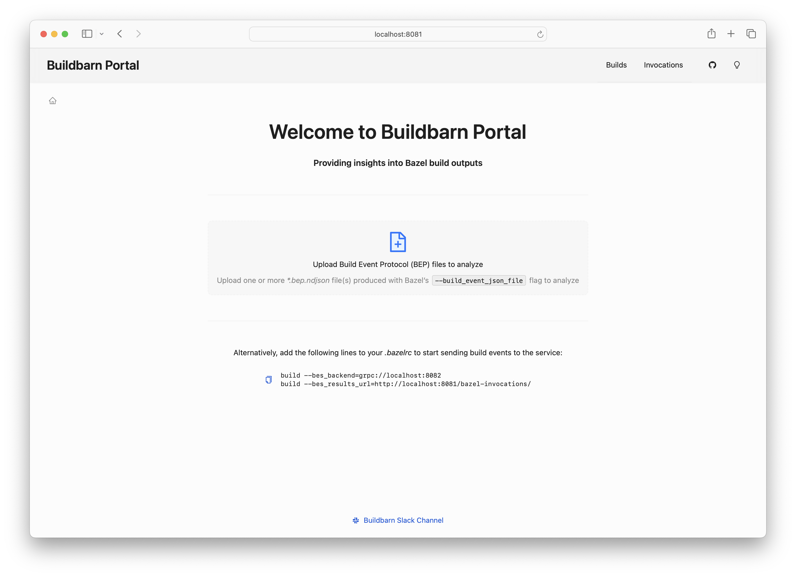
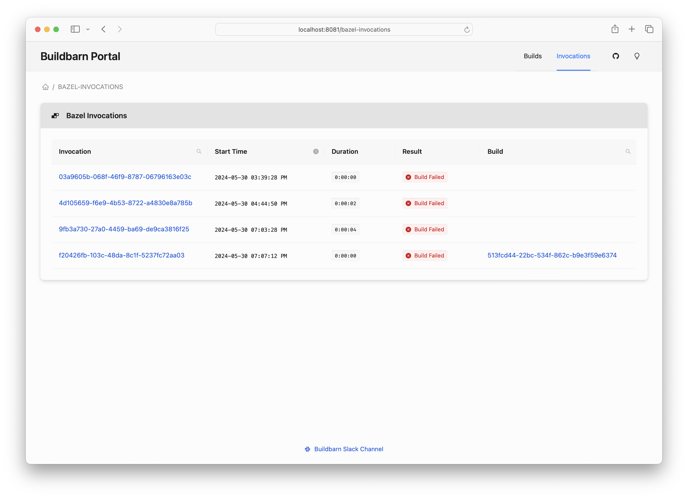
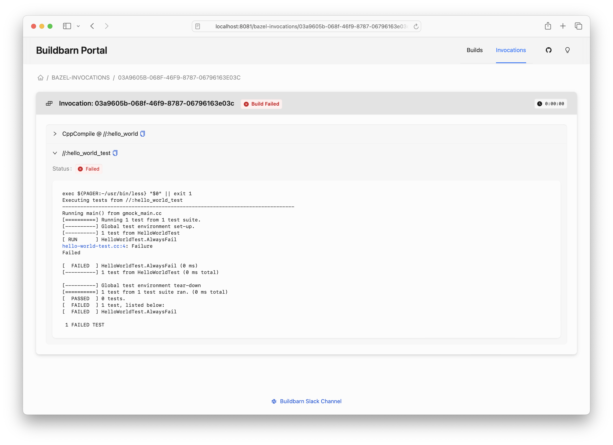
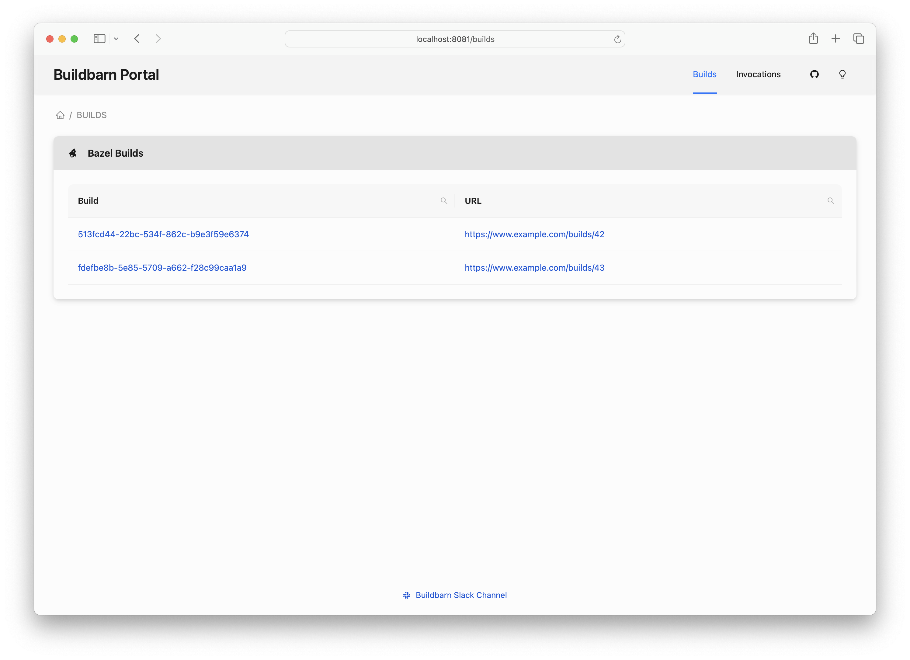
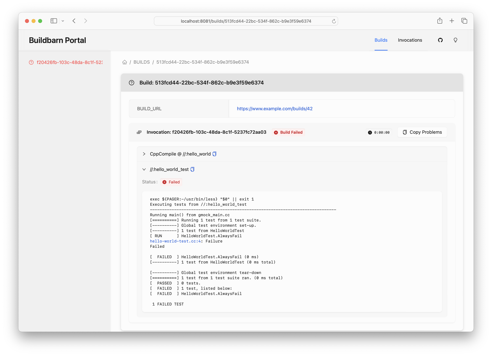

# Buildbarn Portal

Buildbarn Portal is a web service written in React and Go that can display Bazel build output in browsable, digestible fashion.
The service consumes [Build Event Protocol](https://bazel.build/remote/bep) (BEP) data, from local files or as streamed via the [Build Event Service](https://bazel.build/remote/bep#build-event-service) protocol.

Buildbarn Portal groups Bazel invocations into builds based on the observed setting of the `BUILD_URL` environment variable.
If this environment variable is set during an invocation, the invocation will be attributed to a build as identified by the URL.
Buildbarn Portal displays analyzed build output either for individual Bazel invocations, or for builds comprising multiple Bazel invocations.
The grouping of Bazel invocations by build is a differentiating feature of the Buildbarn Portal.

Buildbarn Portal uses a local file-backed database to persist its data so users can continue referencing analyzed results beyond initial viewing.
The service offers basic functionality for browsing and searching among these persisted Bazel invocation results.

## Setting Up Buildbarn Portal

From `./frontend`, run:

```
npm install
```

## Running the Application

### Running the Backend

From repository root, run:

```
bazel run //cmd/bb_portal -- --config-file=$PWD/config/portal.jsonnet
```

The backend runs a reverse proxy for the frontend.

### Running the Frontend

From `./frontend`, run:

```
npm run dev
```

### Change where the backend listens

You can run the backend on different bind addresses, but you'll need to update
the frontend too. Modify the backend ports in the config file, and run the frontend:

```
NEXT_PUBLIC_BES_BACKEND_URL=http://localhost:9091 NEXT_PUBLIC_BES_GRPC_BACKEND_URL=grpc://localhost:9092 npm run dev
```

### Download blobs through bb-browser

You can supply a URL to bb-browser, which is used to create links for downloading blobs:

```
NEXT_PUBLIC_BROWSER_URL=browser.example.com npm run dev
```

Currently this is used to download the build profile.

## Using the Application

Go to http://localhost:8081.
This will go through the reverse proxy that the backend runs.

> **_NOTE:_** Even though the frontend is available directly at http://localhost:3000, APIs don't work on that port, so you will
not be able to see any data if you access the application in this way.

The home page of the application will appear as follows:



Bazel invocations known to the service will be listed on the Bazel invocations landing page:



The problems exhibited during a Bazel invocation will be displayed on a page dedicated to the invocation:



Builds known to the service will be listed on the builds landing page:



From this page, users may navigate to summary views of all invocations associated with a given build:



### Producing BEP File Examples

From `./bazel-demo`, run:

```
bazel test --keep_going --build_event_json_file=build_events_01.ndjson //...
```

This will produce both a build and a test failure in a single example.

You can then upload the `build_events_01.json` output file to see the results in the application.

### Viewing Build Results From BEP Files

Once you have BEP files produced by Bazel, you can upload them via the application homepage.

## Using GraphiQL To Explore the GraphQL API

The GraphiQL explorer is available via http://localhost:8081/graphiql.

## Generated Code

### Build Event Stream Protocol Buffers

Build portal depends on Build Event Stream protobuf generated code.
This dependency is managed through a Bazel project, `third_party/bazel/_generate-via-bazel/`.
The project itself depends on the original protobuf definitions in Bazel's repository, and patches them in order to produce Go code and to do so with package names specific to Build portal.

> **_NOTE:_** The Bazel project itself uses a specific Bazel version.
> If you use [Bazelisk](https://github.com/bazelbuild/bazelisk), it will automatically activate this version based on the [`third_party/bazel/_generate-via-bazel/.bazelversion`](third_party/bazel/_generate-via-bazel/.bazelversion) file.

For more info, see the [Bazel project's README.md](third_party/bazel/_generate-via-bazel/README.md).
