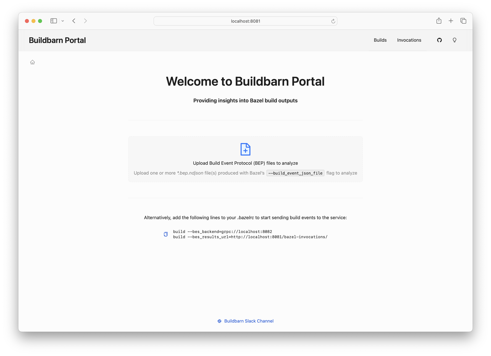
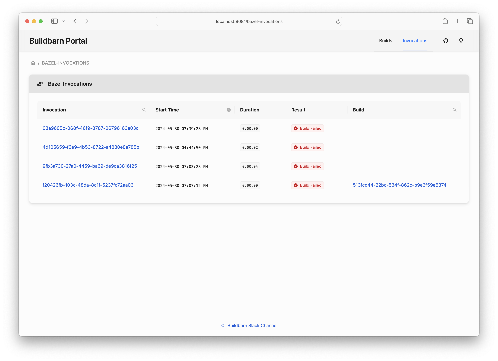
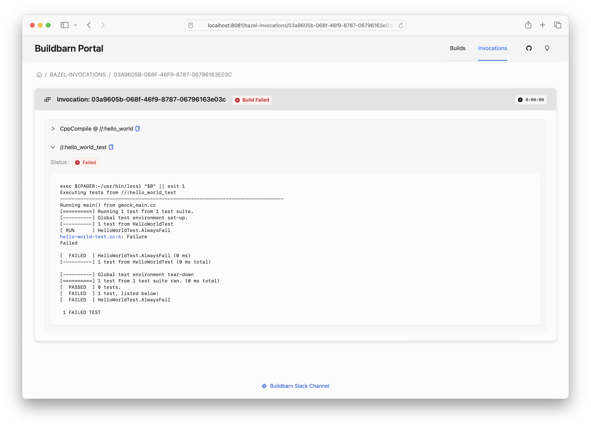
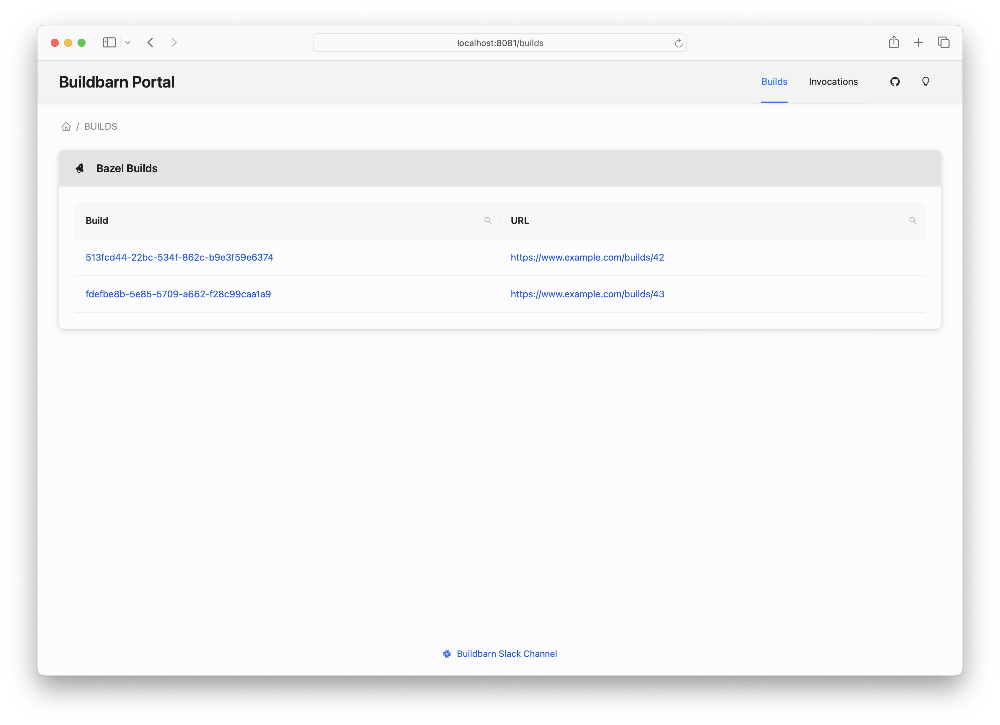
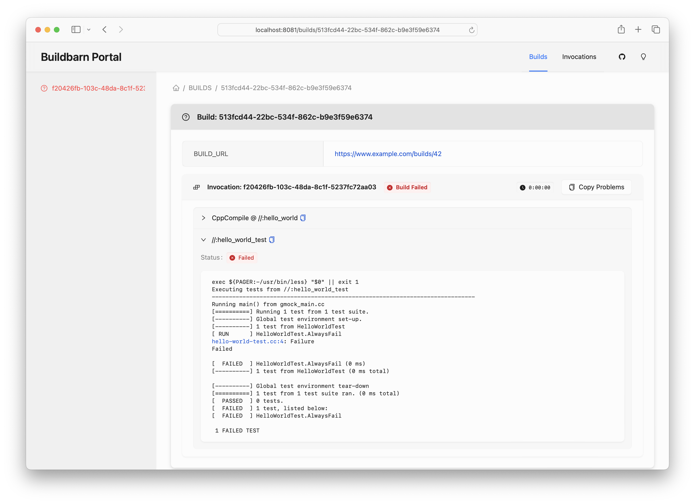

# Buildbarn Portal

Buildbarn Portal is a web service written in React and Go that can display and
visualize Bazel builds and Buildbarn cluster information.

The service consumes [Build Event Protocol](https://bazel.build/remote/bep)
(BEP) data, from local files or as streamed via the
[Build Event Service](https://bazel.build/remote/bep#build-event-service)
protocol, and displays the build results in a web interface.

Buildbarn Portal can display data from the Buildbarn Build Queue State API,
which is used to list, among other things, available workers and current
operations. It is aimed to be a replacement for the web interface of
bb-scheduler.

It can also display and visualize data from the Buildbarn CAS and Action Cache,
similarly to bb-browser, which it is aimed at replacing.

## Configuration

Both the backend and the frontend is configured via a jsonnet configuration
file. Look at `config/portal.jsonnet` for an example configuration file, and
`pkg/proto/configuration/bb_portal/bb_portal.proto` and
`pkg/proto/configuration/frontend/frontend.proto` for the configuration schema.

## Frontend

The frontend is configured in the same Jsonnet file as the backend by using the
field `frontendServiceConfiguration.frontendConfig`. The frontend configuration
type is defined in `pkg/proto/configuration/frontend/frontend.proto`.

The Go backend serves the frontend, either as a proxy to the Vite development
server, or by embedding the production build of the frontend into the Go
binary. The frontend must be served by the backend as it is the backend that
injects the configuration into the frontend.

During development it is recommended to run the backend and frontend
separately. Setup and run the frontend with

```
npm install
npm run dev
```

## Backend

The backend can be started with
```
bazel run //cmd/bb_portal -- $PWD/config/portal.jsonnet
```
In development it is recommended to proxy frontend requests to the Vite
development server by using the config
```
frontendServiceConfiguration.frontendSource.proxy: 'http://localhost:5173'
```
and starting the backend with
```
bazel run //cmd/bb_portal --//pkg/frontend:embed_frontend=False -- $PWD/config/portal.jsonnet
```
to avoid having the rebuild the frontend every time you start the backend.


## Using the Application

Go to <http://localhost:8081>.

The home page of the application will appear as follows:



Bazel invocations known to the service will be listed on the Bazel invocations landing page:



The problems exhibited during a Bazel invocation will be displayed on a page dedicated to the invocation:



Builds known to the service will be listed on the builds landing page:



From this page, users may navigate to summary views of all invocations associated with a given build:



### Producing BEP File Examples

From `./bazel-demo`, run:

```
bazel test --keep_going --build_event_json_file=build_events_01.ndjson //...
```

This will produce both a build and a test failure in a single example.

You can then upload the `build_events_01.json` output file to see the results in the application.

### Viewing Build Results From BEP Files

Once you have BEP files produced by Bazel, you can upload them via the application homepage.

### BB-scheduler

BB-portal can show the same information as the web interface from BB-scheduler. To do this, you need to configure the `schedulerServiceConfiguration` in the portal configuration file. The interface can be found under the `Scheduler` tab in the menu.

### BB-browser

BB-portal can show the same information as BB-browser. Everything it can show is visible under the tab `Browser`. To make the browser functionality work, you need to configure the `browserServiceConfiguration` in the portal configuration file. Despite having the name "browser", it is not possible to browse through the content. Instead other parts of Buildbarn will generate links to the browser. To open the content in bb-portal, the the prefix for the links should be `http://url-to-bb-portal/browser/`. After the `/browser/` prefix, the rest of the URL is compatible with urls for bb-browser.

## Using GraphiQL To Explore the GraphQL API

The GraphiQL explorer is available via <http://localhost:8081/graphiql>.

## Generated Code

### Build Event Stream Protocol Buffers

Build portal depends on Build Event Stream protobuf generated code.
This dependency is managed through a Bazel project, `third_party/bazel/_generate-via-bazel/`.
The project itself depends on the original protobuf definitions in Bazel's repository, and patches them in order to produce Go code and to do so with package names specific to Build portal.

> **_NOTE:_** The Bazel project itself uses a specific Bazel version.
> If you use [Bazelisk](https://github.com/bazelbuild/bazelisk), it will automatically activate this version based on the [`third_party/bazel/_generate-via-bazel/.bazelversion`](third_party/bazel/_generate-via-bazel/.bazelversion) file.

For more info, see the [Bazel project's README.md](third_party/bazel/_generate-via-bazel/README.md).
